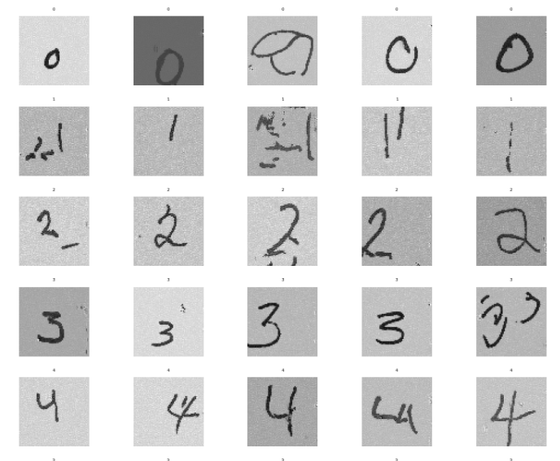
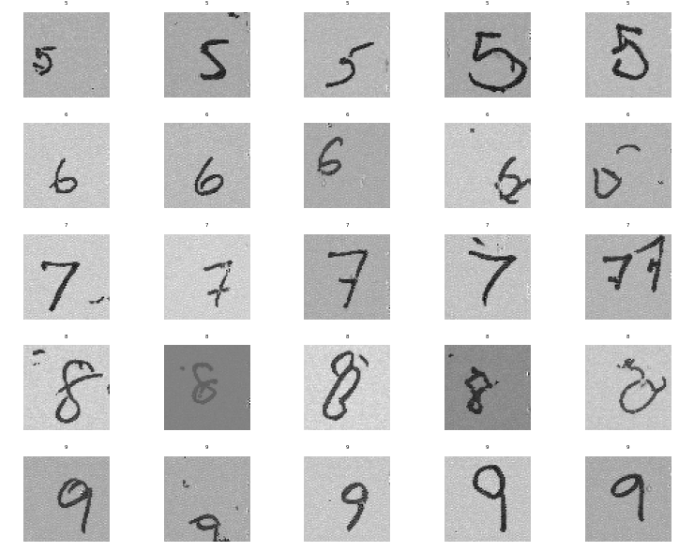

# Flow Matching for Generative Image Synthesis

A PyTorch implementation of **Flow Matching** - a modern generative modeling technique for synthesizing high-quality images. This project demonstrates conditional flow matching on handwritten digit data, producing realistic samples through learned continuous normalizing flows.

## Overview

Flow Matching is an alternative to diffusion models that learns to transport samples from a simple prior distribution (e.g., Gaussian noise) to a complex data distribution through a continuous-time flow. Unlike diffusion models that require many denoising steps, flow matching directly learns the velocity field of an optimal transport path.

### Key Features

- Conditional Flow Matching implementation with class guidance
- UNet-based velocity field network
- Support for both guided and unguided generation
- PyTorch Lightning training pipeline
- Generates high-quality handwritten digit samples

## Generated Samples

The model successfully generates diverse handwritten digits after training. Below are samples generated using the trained flow matching model:


| **Digits 0-4** | **Digits 5-9** |
|:--------------:|:--------------:|
|  |  |


Each row shows 5 different samples generated for the corresponding digit class, demonstrating the model's ability to capture style variations while maintaining digit identity.

## Project Structure

```
.
├── notebooks/
│   ├── Flow_Matching.ipynb    # Main flow matching implementation & training
│   ├── 0-4.png                # Generated samples (digits 0-4)
│   └── 5-9.png                # Generated samples (digits 5-9)
├── scripts/
│   ├── model.py               # Transformer architecture (for translation)
│   ├── dataset.py             # Dataset utilities
│   ├── train.py               # Training script
│   └── train_tokenizer.py     # Tokenizer training
├── data/
│   ├── Images(28x28).npy      # Training images
│   └── *.ckpt                 # Model checkpoints
├── requirements.txt           # Python dependencies
└── train.sh                   # Training execution script
```

## How Flow Matching Works

1. **Forward Process**: Define a probability path `p_t(x)` that interpolates between noise `p_0` and data `p_1`
2. **Velocity Field**: Learn a neural network `v_θ(x, t)` that predicts the velocity of samples along this path
3. **Training**: Minimize the flow matching objective by regressing to the conditional velocity field
4. **Sampling**: Integrate the learned velocity field from `t=0` to `t=1` using an ODE solver

The key insight is that we can train with a simple regression loss on conditional flows, avoiding the need for simulation during training.

## Requirements

- Python 3.8+
- PyTorch
- PyTorch Lightning
- NumPy
- Matplotlib
- Jupyter

Install dependencies:
```bash
pip install -r requirements.txt
```

## Usage

### Training

Run the flow matching notebook:
```bash
jupyter notebook notebooks/Flow_Matching.ipynb
```

Or execute via script:
```bash
./train.sh
```

### Generating Samples

After training, load the checkpoint and generate samples:
```python
# Load trained model
model.load_state_dict(torch.load('data/unguided_model_epoch=51.ckpt'))

# Generate samples for a specific digit class
samples = model.sample(num_samples=25, class_label=3)
```

## Model Architecture

The velocity field network uses a **UNet architecture** with:
- Time embedding via sinusoidal positional encoding
- Class conditioning through embedding layers
- Skip connections between encoder and decoder
- Group normalization and SiLU activations

## Training Details

- **Dataset**: Handwritten digits (28x28 grayscale)
- **Batch Size**: Configurable (trained on small batches)
- **Optimizer**: Adam with learning rate scheduling
- **Training Time**: ~50 epochs for satisfactory results

## References

- [Flow Matching for Generative Modeling](https://arxiv.org/abs/2210.02747) - Lipman et al., 2022
- [Rectified Flow](https://arxiv.org/abs/2209.03003) - Liu et al., 2022
- [Conditional Flow Matching](https://arxiv.org/abs/2302.00482) - Tong et al., 2023

## License

This project is for educational and research purposes.

---

*Generated samples demonstrate the effectiveness of flow matching for conditional image generation.*
